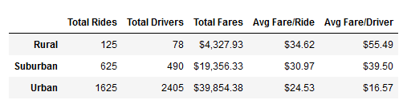
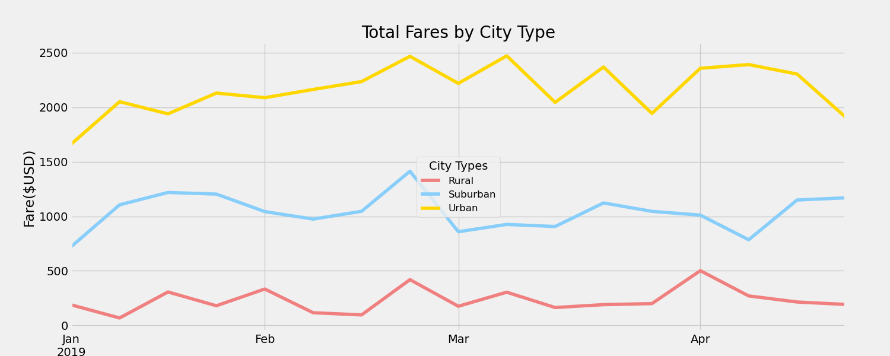

# PyBer_Analysis
## Purpose
V. Isualize has given us the task of analyzing rideshare data and sort it primarily by the type of city where the rides are given. By disseminating that data into fares by ride and fares by drivers, and compare that to the three types of city we have in our data. Those three types of city are rural, suburban, and urban. We are to present that analysis in a way that can be easily readable line graph. This analysis and data will give V. Isualize a basis for business decisions and set up locations for their ride share app.

## Results
Our analysis of the data has come up with the following results:

The number of total rides in the rural city were much lower than in suburban and urban cities. On the other side of things rides in an urban city type were significantly higher than the other two city types. This pattern continued across total rides and total drivers. However, this changes when we examine the fares per ride and per driver data. Rural cities provide significantly higher fares per ride and driver than suburban and urban cities. This is likely due to the nature of rural cities - houses and commercial areas are farther away from one anothe thus leading to longer trips. Conversely, the nature of these city types is also at the root of the lower fares, drivers, and rides. There is more space beccause there is simply less people i a rural setting

## Summary
Our analysis has shown that while urban settings bring in a significant amount of fare revenue, the margin does seem to be higher for rides in a rural atmosphere. Suburban ride sharing data sits in the middle of the two. All of these observations are seen in our data summary.

This leaves us with three conclusions: if V. Isualize can exist with a small margin and operate solely on quantity it should open in an urban atmosphere. However, if thin margins do not work with their business model it is possible to open in a rural atmosphere with much wider margins for the business - each ride brings in significantly more money than the urban city type. Creating a suburban ride share app would act as a middle ground - margins are middling as well as quantity of rides.
